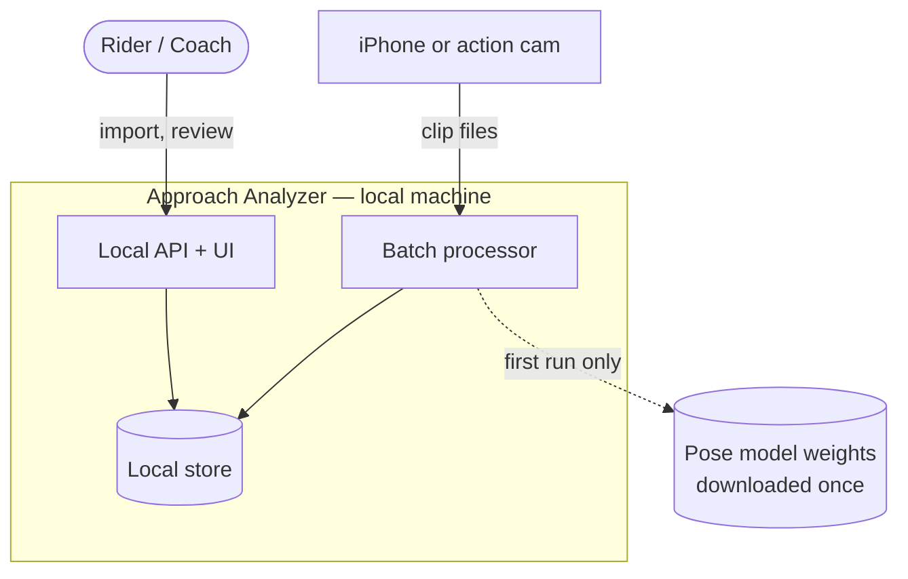
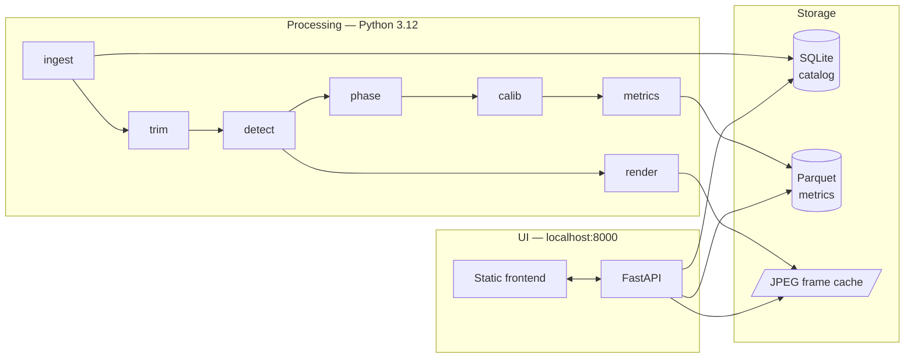
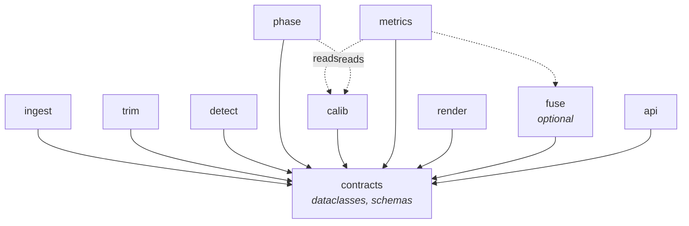
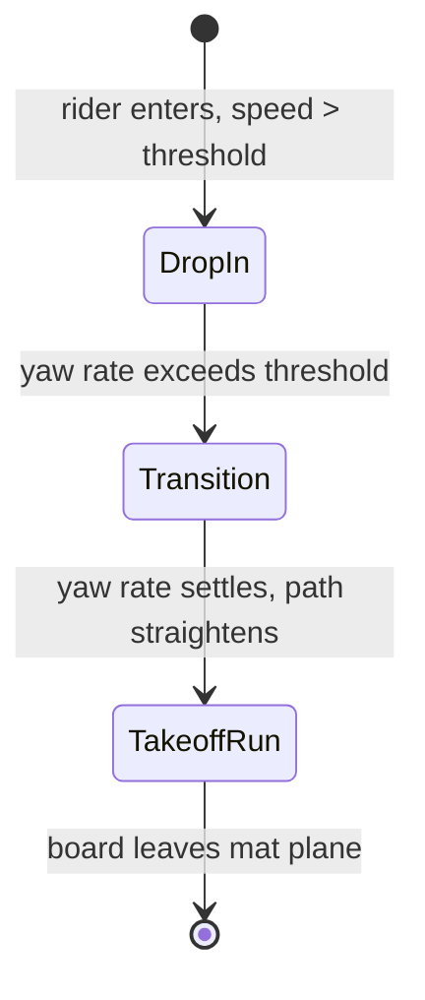
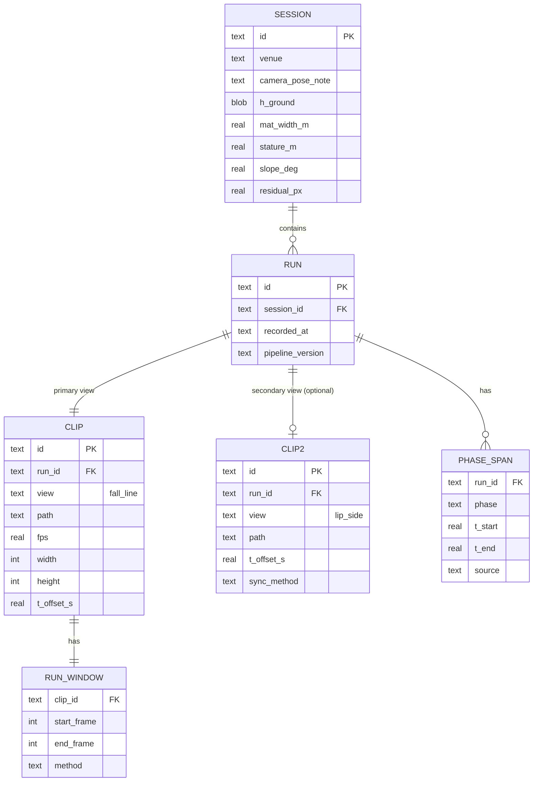
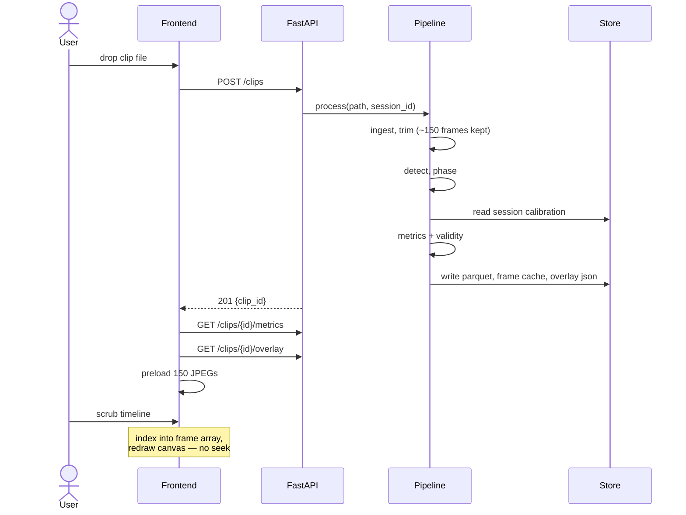
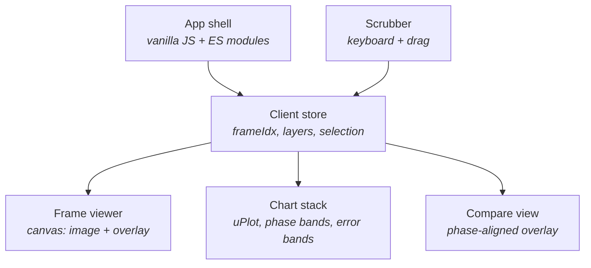

# Snowboard Approach Analyzer — Software Architecture Design

**Status:** Draft 1 · 2026-09-08
**Scope:** Offline video analysis of snowboard jump approaches, drop-in through takeoff
**Target platform:** macOS on Apple silicon, single user, local-only

---

## 1. Purpose

Import short video clips of a snowboard jump approach and produce per-frame biomechanical
metrics — joint angles, centre of mass, board kinematics — presented on a scrubable timeline
synchronised with the footage.

Analysis begins when the rider drops in and ends when the board leaves the takeoff lip.
Airborne phase, rotation and landing are explicitly out of scope.

### 1.1 View model

A **run** is one descent. It has exactly one **primary view** — the fall-line camera at the top
of the ramp — and optionally one **secondary view** from beside the lip, shot simultaneously
with matching timestamps.

The secondary view usually does not exist. The system is therefore designed single-view first:
every feature works from the primary view alone, and the secondary view is a *quality upgrade*
that promotes certain metrics from degraded or invalid to valid. Nothing degrades or breaks
when it is absent, and no code path is conditional on its presence except the fusion stage.

### 1.2 Reference footage

All numbers in this document are measured from the sample clip rather than assumed.

| Property | Value |
| --- | --- |
| Frame | 2160 × 3840 (portrait, `rotation=-90` side data) |
| Codec / rate | HEVC Main, 59.97 fps, ~64 Mb/s |
| Clip length | 15.0 s, 904 frames |
| Run window | ≈3.95 s – 6.45 s (≈150 frames, 17% of clip) |
| Camera | Static, elevated, looking down the fall line |
| Lighting | Night, floodlit; brightness CV 0.4%, no flicker beat |
| Rider height in frame | 790 px @ 4.50 s · 425 px @ 5.20 s · 220 px @ 6.30 s |

> [!NOTE]
> Ground sampling in millimetres equals `1750 / rider_px_height` for a 1.75 m rider.
> This holds without any camera calibration and drives every error bar in the system.

---

## 2. Requirements

### 2.1 Functional

| ID | Requirement |
| --- | --- |
| F-1 | Import a `.mov`/`.mp4` clip from local disk and register it against a session |
| F-2 | Automatically locate the run window and discard non-run frames |
| F-3 | Estimate 2D pose per frame with per-keypoint confidence |
| F-4 | Segment the run into drop-in, transition, and takeoff-run phases |
| F-5 | Map image coordinates to mat-plane metric coordinates |
| F-6 | Compute joint angles, centre of mass, and board kinematics with uncertainty |
| F-7 | Mark each metric valid or invalid according to phase geometry |
| F-8 | Present a frame-accurate timeline with charts synchronised to the footage |
| F-9 | Overlay skeleton, board axis and CoM on the footage, layers individually toggleable |
| F-10 | Compare two runs on a phase-aligned common timeline |
| F-11 | Export metrics as CSV/Parquet for external analysis |
| F-12 | Accept an optional second simultaneous view and attach it to the same run |
| F-13 | Where a second view exists, select the better source per metric and record which was used |

### 2.2 Non-functional

| ID | Requirement | Target |
| --- | --- | --- |
| N-1 | End-to-end processing of one clip | < 60 s on M-series |
| N-2 | Timeline scrub latency | < 16 ms per frame step |
| N-3 | Offline operation | No network dependency after model download |
| N-4 | Reproducibility | Same input + same config ⇒ byte-identical metrics |
| N-5 | Storage per clip | < 100 MB including frame cache |
| N-6 | Model swappability | Pose backend replaceable without touching metrics code |

---

## 3. Architecture drivers

1. **The useful data is tiny.** 150 frames per run. This permits design choices that would be
   absurd at scale — full frame caching, eager recomputation, no streaming.
2. **The camera is static and the venue is fixed.** Calibration is a session-scoped constant,
   not a per-frame problem.
3. **Measurement validity varies by phase.** The rider's direction of travel rotates onto the
   optical axis through the run. Phase is a first-class dimension, not metadata.
4. **Precision degrades with distance.** Every value must carry an uncertainty derived from
   rider pixel height.
5. **Single user, local machine.** No auth, no multi-tenancy, no horizontal scaling.

---

## 4. System context



---

## 5. Container view



---

## 6. Module design

### 6.1 Dependency rule

Modules depend only downward. `metrics` never imports `detect`; it consumes a data contract.
This is what makes N-6 (pose backend swappability) cheap.



`fuse` is the only module aware that more than one camera can exist. It is a pure function
from metric samples to metric samples, so removing it leaves a working single-view system.

### 6.2 Contracts

```python
# contracts.py — the only module everything else may import

class ViewRole(StrEnum):
    FALL_LINE = "fall_line"   # primary, always present
    LIP_SIDE  = "lip_side"    # optional, perpendicular to travel

@dataclass(frozen=True)
class ClipMeta:
    clip_id: str
    run_id: str
    view: ViewRole
    path: Path
    width: int           # after rotation applied
    height: int
    fps: float
    n_frames: int
    rotation_deg: int
    recorded_at: datetime
    t_offset_s: float    # clip time -> run time; 0.0 for the primary view

@dataclass(frozen=True)
class RunWindow:
    start_frame: int
    end_frame: int
    method: str          # "motion_energy" | "manual"

@dataclass(frozen=True)
class PoseFrame:
    frame_idx: int
    t_sec: float
    keypoints: np.ndarray    # (26, 2) float32, image pixels, HALPE-26
    scores: np.ndarray       # (26,) float32
    bbox: tuple[int, int, int, int]
    rider_px_h: float        # drives all uncertainty downstream

class Phase(StrEnum):
    DROP_IN = "drop_in"
    TRANSITION = "transition"
    TAKEOFF_RUN = "takeoff_run"

@dataclass(frozen=True)
class Calibration:
    h_ground: np.ndarray     # 3x3 image -> mat plane homography
    mat_width_m: float
    stature_m: float
    slope_deg: float
    method: str              # "manual_4pt" | "hough_auto"
    residual_px: float       # reprojection error, for QA

@dataclass(frozen=True)
class MetricSample:
    run_id: str
    view: ViewRole       # which camera produced this value
    frame_idx: int
    t_sec: float         # run time, not clip time
    phase: Phase
    metric: str
    value: float
    confidence: float
    err_est: float
    valid: bool
```

> [!NOTE]
> `t_sec` is **run time**, defined by the primary view. A secondary clip's frames are shifted by
> its `t_offset_s` on ingest, so every consumer downstream works in one shared timebase and
> never has to know that two cameras existed.

### 6.3 Module responsibilities

<details>
<summary><b>ingest</b> — decode and normalise</summary>

Reads the container with PyAV. Applies `rotation` side data explicitly rather than trusting
decoder defaults, since behaviour varies between ffmpeg builds. Emits `ClipMeta` and a frame
iterator keyed on presentation timestamp, not frame index, so variable-rate captures stay
correct.

**Out:** `ClipMeta`, `Iterator[tuple[int, float, np.ndarray]]`
</details>

<details>
<summary><b>trim</b> — locate the run</summary>

Builds a median background from ~15 sparse frames, thresholds absolute difference at quarter
resolution, and finds the sustained large-blob window. Pads ±0.5 s. Falls back to manual
in/out points if confidence is low.

> [!TIP]
> This is the highest-leverage stage in the pipeline. Discarding 83% of frames before any
> model runs makes everything downstream roughly six times cheaper for one afternoon of work.

**Out:** `RunWindow`
</details>

<details>
<summary><b>detect</b> — pose and board</summary>

Person detection first, pose second. Explicitly **not** background subtraction: the floodlit
cast shadow on the pale matting is rider-sized and was observed inflating motion bounding
boxes to more than twice the rider's true height.

Crops the tracked person with margin and upscales to model input resolution so a 205 px rider
at the lip still receives a full-resolution inference pass. Records `rider_px_h` per frame.

Board axis derives from the HALPE-26 foot keypoints (big toe, small toe, heel on each foot).
An optional segmentation backend can override when confidence is high.

**Backend protocol:**
```python
class PoseBackend(Protocol):
    name: str
    def infer(self, frames: Sequence[np.ndarray]) -> list[PoseFrame]: ...
```
**Out:** `list[PoseFrame]`
</details>

<details>
<summary><b>phase</b> — segment the run</summary>

Board yaw rate and path curvature on the mat plane drive a three-state machine. Boundaries are
persisted so they can be corrected by hand and reused.


**Out:** `dict[Phase, tuple[float, float]]`
</details>

<details>
<summary><b>calib</b> — image to mat plane</summary>

Four correspondences on the dry-slope tile grid give the ground homography via
`cv2.findHomography`. The grid is dense, regular and sharp across the full run, including the
far field. An automatic mode uses `HoughLinesP` on the lane boundaries and transverse seams,
intersecting for vanishing points.

Scoped to **session**, not clip: the camera is static within a clip and, with a marked tripod
position, static between them.

Vertical scale comes from rider stature at a known ground point — the ground homography says
nothing about height.

**Out:** `Calibration`
</details>

<details>
<summary><b>metrics</b> — biomechanics</summary>

Order matters: gap-fill → filter → derive. Never differentiate a raw signal.

1. Reject keypoints below confidence threshold; confidence-weighted interpolation across gaps
2. Butterworth low-pass at 8 Hz, or Savitzky–Golay where a derivative is needed
3. Joint and segment angles
4. Centre of mass by segment-mass-weighted sum using de Leva anthropometric tables
5. Project CoM onto board axes; transform contact point through `h_ground`
6. Attach `err_est = 3 * 1750 / rider_px_h` mm and `valid` from the phase validity matrix

**Out:** `list[MetricSample]`
</details>

<details>
<summary><b>render</b> — frame cache and overlays</summary>

Writes the run window as individual JPEGs at display resolution (1080 px long edge, quality 85).
150 frames ≈ 20 MB. Overlay geometry is emitted as JSON, **not** burned in, so the frontend can
toggle layers on canvas without re-rendering.

**Out:** `frames/{clip_id}/{frame_idx:05d}.jpg`, `overlay/{clip_id}.json`
</details>

<details>
<summary><b>fuse</b> — optional, only when a second view exists</summary>

The single stage that knows about multiple views. Everything upstream runs once per clip,
unchanged and unaware.

**Not triangulation.** The two cameras are roughly orthogonal and share no calibrated
extrinsics, so full 3D reconstruction would require a stereo calibration the user will never
perform. Instead each view measures the axes it is good at, and this stage performs **source
selection**: for every metric and phase, pick whichever available view has the better validity
rating, breaking ties on lower `err_est`.

```python
def fuse(primary: list[MetricSample],
         secondary: list[MetricSample] | None) -> list[MetricSample]:
    if secondary is None:
        return primary                    # the normal case
    return select_best_source(primary, secondary)
```

Resampling: the secondary view is interpolated onto the primary view's frame grid after its
`t_offset_s` is applied. The primary view defines the timebase and the frame cache; the
secondary view contributes values, never frames.

**Out:** `list[MetricSample]` — same type in, same type out, so this stage is removable.
</details>

---

## 7. Data architecture

### 7.1 Storage layout

```
~/Library/Application Support/sbanalyze/
├── catalog.sqlite
├── metrics/{clip_id}.parquet
├── frames/{clip_id}/00234.jpg …
├── overlay/{clip_id}.json
└── models/            # rtmlib ONNX weights, downloaded once
```

### 7.2 Relational schema



### 7.3 Metrics table

Long format. One row per metric per frame.

| Column | Type | Note |
| --- | --- | --- |
| `run_id` | string | |
| `view` | dictionary | `fall_line` / `lip_side` — provenance of this value |
| `frame_idx` | int32 | on the primary view's frame grid |
| `t_sec` | float32 | run time |
| `phase` | dictionary | drop_in / transition / takeoff_run |
| `metric` | dictionary | `com_height`, `knee_flex_l`, … |
| `value` | float32 | metric units |
| `confidence` | float32 | propagated from keypoint scores |
| `rider_px_h` | float32 | provenance for `err_est` |
| `err_est` | float32 | metric units |
| `valid` | bool | false where phase geometry kills it |

> [!TIP]
> Long format means adding a metric never requires a schema migration, and the validity flag
> travels with the value so no chart can display a number the geometry doesn't support.

### 7.4 Phase validity matrix

Hard-coded, versioned, and applied in `metrics`. Keyed on `(metric, phase, view)`.

**Primary view — fall-line camera.** This is the table that applies to almost every run.

| Metric | Drop-in | Transition | Takeoff run |
| --- | --- | --- | --- |
| `knee_flex_l/r`, `trunk_lean` | valid | valid | valid |
| `com_height`, `com_lateral` | valid | valid | valid |
| `line_offset`, `speed_along` | valid | valid | valid |
| `com_foreaft`, `board_pitch` | valid | degraded | **invalid** |
| `board_yaw` | valid | valid | degraded |

**Secondary view — lip-side camera, when present.** Rotated ninety degrees, so its strengths
and weaknesses are the mirror image.

| Metric | Drop-in | Transition | Takeoff run |
| --- | --- | --- | --- |
| `com_foreaft`, `board_pitch` | degraded | valid | **valid** |
| `com_height` | valid | valid | valid |
| `com_lateral`, `line_offset` | **invalid** | degraded | degraded |
| `knee_flex_l/r` | degraded | valid | valid |

The two tables are complementary by construction. `fuse` takes the better rating per cell, so a
two-camera run has no invalid cells at all, and the exact axis the primary view loses at the lip
is the one the secondary view measures best.

### 7.5 Synchronising two views

The two cameras record simultaneously and report matching wall-clock timestamps, so a coarse
offset comes free from container metadata. That is not the same as frame alignment: independent
device clocks drift, and phone timestamps are typically accurate to a fraction of a second — at
60 fps that is tens of frames.

Three tiers, in order of preference:

| Tier | Method | Accuracy | When |
| --- | --- | --- | --- |
| 1 | Container `creation_time` difference | ±0.3 s | Always available; the default |
| 2 | Cross-correlate `com_height` between views | ±1 frame | Automatic refinement over tier 1 |
| 3 | Manual nudge in the UI | exact | Fallback when tier 2 has low correlation |

Tier 2 works because CoM height is the one metric both views measure well, and the
compression–extension signature through the run is distinctive. Correlate over the tier-1
window ±0.5 s, take the peak, store the result in `CLIP.t_offset_s` with `sync_method`.

> [!TIP]
> Persist the offset, don't recompute it. A given camera pair at a given venue will have a
> stable clock relationship across a session, so tier 2 need only run on the first run of the
> day and can seed the rest.

---

## 8. Key sequence — import to timeline



---

## 9. UI architecture

### 9.1 Decision — local web app

Evaluated against native SwiftUI, PySide6, Streamlit, and Tauri.

| Criterion | Web (FastAPI + static) | Native Swift | PySide6 | Streamlit |
| --- | --- | --- | --- | --- |
| Language boundary | none — Python both sides | rewrite or shell out | none | none |
| Charting quality | excellent (uPlot, Plotly) | weak | fair (pyqtgraph) | fair |
| Frame-accurate scrub | solved by frame cache | native strength | good | poor |
| Canvas overlay control | excellent | good | fair | poor |
| Shareability later | serve a URL | ship a binary | ship a binary | serve a URL |
| Packaging cost | none | high | medium | none |

**Chosen: local web app.** The one thing native does clearly better — frame-accurate video
playback — is designed out by ADR-001. Everything else favours the browser.

### 9.2 No video element

The run is 150 frames. Rather than a `<video>` element with approximate `currentTime` seeking
and a `timeupdate` event that fires at roughly 4 Hz, the frontend preloads the run as an
`Image[]` and indexes into it.

Consequences:
- Frame-accurate by construction, forwards and backwards
- Scrub latency is one canvas blit, comfortably inside N-2
- No HEVC decode concerns in the browser
- Chart cursor and frame index are the same integer, so sync is not a problem to solve

The full-length original clip stays on disk for reference but is never loaded by the UI.

### 9.3 Frontend composition



- **uPlot** over Plotly for the metric stack — it redraws a cursor across a dozen synchronised
  charts without dropping frames, which Plotly does not.
- **Canvas, not SVG**, for the frame viewer. One draw call for the image, one path per overlay
  layer.
- **No framework** initially. The state is one integer and a set of booleans. Reach for a
  framework only if the compare view gets complicated.

**When a second view exists**, the frame viewer gains a toggle between views and the charts do
not change at all — they are already in run time and already carry a `view` column. Each series
shows a small provenance marker indicating which camera produced it. The primary view remains
the default and the timebase; a run with one view simply has the toggle disabled.

### 9.4 Presentation rules

1. Phase bands render behind every chart, always visible.
2. `err_est` renders as a band around each series, always visible.
3. Where `valid` is false, the series greys out rather than disappearing — a visibly suppressed
   fore/aft trace in the takeoff run teaches the geometry; a missing one looks like a bug.
4. Keyboard: `←`/`→` step one frame, `,`/`.` step ten, `space` plays at real time.

### 9.5 API surface

| Method | Path | Returns |
| --- | --- | --- |
| `POST` | `/sessions` | create session, accept calibration points |
| `POST` | `/clips` | import and process; returns `clip_id` |
| `GET` | `/clips` | catalog listing |
| `GET` | `/clips/{id}` | `ClipMeta` + run window + phase spans |
| `GET` | `/clips/{id}/metrics` | metric series as JSON, optionally filtered |
| `GET` | `/clips/{id}/overlay` | per-frame overlay geometry |
| `GET` | `/clips/{id}/frames/{n}` | JPEG from cache |
| `POST` | `/runs/{id}/views` | attach an optional second clip to an existing run |
| `PATCH` | `/runs/{id}/sync` | override `t_offset_s` manually |
| `GET` | `/compare?a={id}&b={id}` | phase-aligned resampled series |
| `GET` | `/clips/{id}/export.csv` | flat export |

---

## 10. Cross-cutting concerns

**Configuration.** Single `config.toml` — thresholds, filter cutoffs, model choice, paths.
Every processing run records the resolved config hash and `pipeline_version` in `CLIP`, which
is what makes N-4 achievable.

**Determinism.** Pin model weights by checksum. Fix ONNX Runtime thread count. No wall-clock
or random seeds in the metric path.

**Error handling.** Processing is a pipeline of pure-ish stages; each returns either a result
or a typed failure. A clip that fails at `trim` is stored with status `needs_manual_window`
rather than discarded, and the UI offers manual in/out points.

**Quality assurance in-band.** Persist `residual_px` from the homography fit and mean keypoint
confidence per phase. Surface both in the UI header. A run with poor calibration should look
poor, not silently wrong.

**Logging.** Structured JSON lines per stage with frame counts and durations. Useful for the
one performance question that matters: where the 60 s budget goes.

---

## 11. Architecture decision records

| ID | Decision | Rationale | Status |
| --- | --- | --- | --- |
| ADR-001 | Frame cache instead of a video element | 150 frames makes frame-accurate scrubbing trivial and removes the main reason to go native | Accepted |
| ADR-002 | Local web app over native or Streamlit | Python continuity, superior charting, no packaging cost | Accepted |
| ADR-003 | `rtmlib` for keypoints, not the Sports2D pipeline | Sports2D's pixel-to-metre step assumes a plane parallel to the camera, which this geometry violates | Accepted |
| ADR-004 | RTMPose over MediaPipe | Higher reported accuracy; throughput irrelevant at 150 frames | Accepted |
| ADR-005 | Person detector, not background subtraction | Floodlit cast shadow is rider-sized and was observed doubling motion bounding boxes | Accepted |
| ADR-006 | Session-scoped calibration | Camera is static within and between clips at a fixed venue | Accepted |
| ADR-007 | Long-format Parquet with validity flags | Adding metrics without migration; geometry constraints travel with values | Accepted |
| ADR-008 | Scope terminates at takeoff | Removes ballistic modelling, rotation tracking and landing detection entirely | Accepted |
| ADR-009 | Foot-axis board estimate as primary | Survives occlusion and foreshortening; segmentation is an optional override | Accepted |
| ADR-010 | Single-view first; second view is an optional upgrade | The lip camera usually does not exist, so it cannot be load-bearing. Isolating it to one removable stage keeps the common path simple | Accepted |
| ADR-011 | Source selection, not triangulation | The two views are roughly orthogonal and share no calibrated extrinsics. Picking the better view per metric needs no stereo calibration and delivers most of the benefit | Accepted |
| ADR-012 | Primary view owns the timebase and frame cache | The secondary view contributes values, never frames, so the UI stays a single-sequence viewer | Accepted |

---

## 12. Testing strategy

| Level | What | How |
| --- | --- | --- |
| Unit | de Leva CoM computation | Known segment inputs, hand-computed expected CoM |
| Unit | Homography round-trip | Synthetic grid, project and unproject, assert sub-pixel |
| Unit | Phase state machine | Synthetic yaw-rate traces including edge cases |
| Contract | Pose backend protocol | Fake backend returning fixed keypoints |
| Golden | Full pipeline on the sample clip | Assert metric series within tolerance of a committed reference |
| Visual | Overlay rendering | Render three known frames, compare against committed PNGs |
| Manual | Phase boundaries | Reviewed against human judgement on each new venue |
| Unit | `fuse` with `secondary=None` | Assert output is identical to input — the removability guarantee |
| Unit | Offset estimation | Synthetic CoM traces with a known shift |

> [!NOTE]
> The golden-clip test is the backbone. It catches the failure mode that matters most —
> a change that keeps the pipeline running but silently shifts the numbers.

---

## 13. Repository layout

```
snowboard-approach-analyzer/
├── README.md
├── docs/
│   ├── architecture.md            # this document
│   ├── calibration-guide.md       # on-site measurement procedure
│   └── capture-guide.md           # shooting spec
├── src/sbanalyze/
│   ├── contracts.py
│   ├── ingest.py
│   ├── trim.py
│   ├── detect/
│   │   ├── base.py                # PoseBackend protocol
│   │   ├── rtm.py
│   │   └── board.py
│   ├── phase.py
│   ├── calib.py
│   ├── metrics/
│   │   ├── angles.py
│   │   ├── com.py                 # de Leva tables
│   │   └── validity.py
│   ├── fuse.py                    # optional second-view merge
│   ├── render.py
│   ├── store.py
│   └── api.py
├── web/
│   ├── index.html
│   ├── viewer.js
│   ├── charts.js
│   └── store.js
├── tests/
│   ├── golden/
│   └── fixtures/
└── config.toml
```

---

## 14. Delivery milestones

| # | Milestone | Proves |
| --- | --- | --- |
| M1 | `trim` + `rtmlib` overlay on the sample clip | Usable pose range across the whole run |
| M2 | Manual four-point homography; contact-point speed | Calibration approach produces plausible physics |
| M3 | Phase segmentation, verified by eye | The organizing abstraction is sound |
| M4 | CoM height and lateral offset with error bars | First output the eye cannot produce |
| M5 | Frame-cache timeline UI against static JSON | The core interaction feels right |
| M6 | FastAPI backend, catalog, import flow | End-to-end product |
| M7 | Phase-aligned comparison view | The feature most likely to change how someone rides |
| M8 | *(optional)* Second view: ingest, sync, fuse | Only if a lip-side camera becomes available |

M1 and M2 together are roughly an afternoon and answer the only question that matters early:
whether the single-camera version is worth finishing, or whether a second camera at the lip
should come first.

---

## 15. Risks

| Risk | Impact | Mitigation |
| --- | --- | --- |
| Pose degrades below ~200 px at the lip | Takeoff metrics unreliable in the phase that matters most | Crop-and-upscale; surface confidence; consider a lip-side camera |
| Cast shadow confuses the detector | Wrong bounding box, wrong keypoints | Appearance-based detection; reject flat mat-plane dark regions |
| Tripod position drifts between sessions | Calibration silently wrong | Persist `residual_px`; warn when it exceeds threshold |
| Phase boundaries wrong on an unfamiliar venue | Validity flags misapplied | Manual override persisted per clip |
| de Leva tables assume a standing adult | CoM bias for youth riders | Expose stature and segment-table choice in config |
| Device clock offset larger than expected | Fused values attributed to the wrong frame | Tier-2 cross-correlation with a correlation-quality threshold; manual nudge as fallback |
| Second-view support rots from disuse | Broken when finally needed | `fuse(secondary=None)` identity test runs on every build |

---

## 16. Open questions

1. **Secondary view calibration** — does the lip-side camera need its own ground homography, or
   is source selection on validity alone sufficient? Selection needs no calibration; metric
   values in physical units from that view would need one. Deferred until a lip camera exists.
2. **Board length** — is it known and constant? It is a useful secondary scale check.
3. **Session portability** — should calibration be keyed to a named camera position the user
   selects at import, rather than inferred?
4. **Retention** — keep original clips indefinitely, or discard after processing and keep only
   the frame cache?
